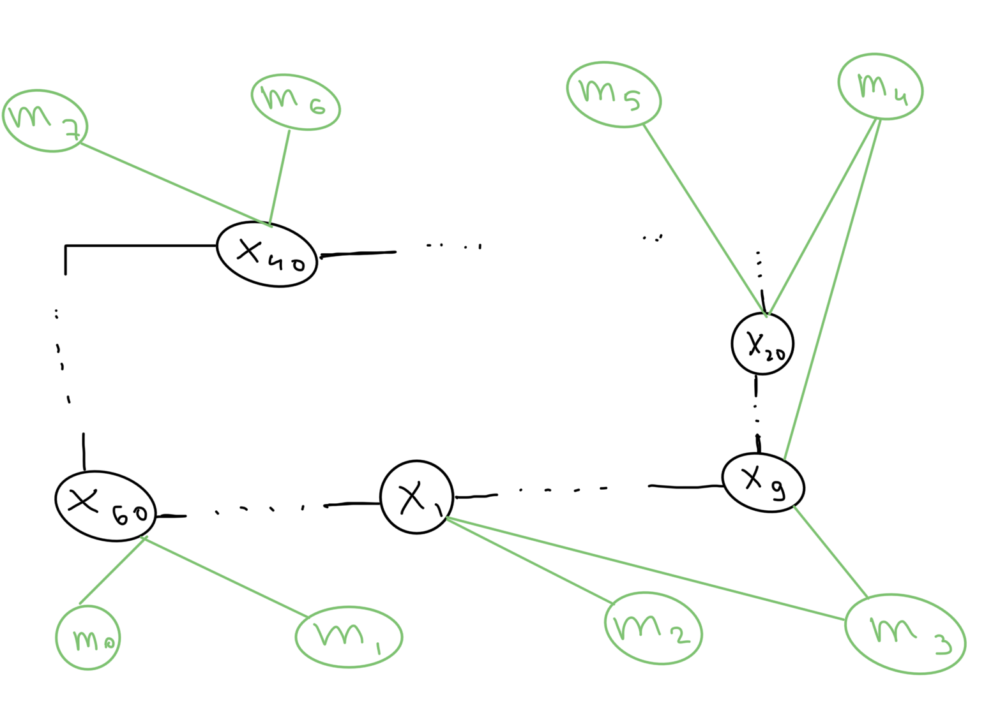
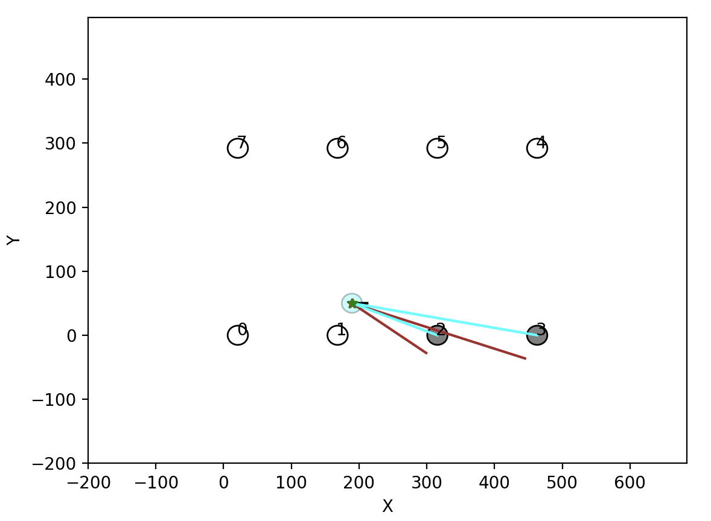
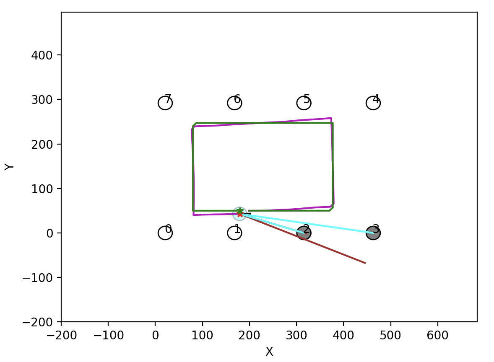

### PS3 done by Fatykhoph Denis

#### Task 1. Graph SLAM
##### B. Odometry

```shell
Graph state BEFORE adding odometry factor:
[array([[180.],
       [ 50.],
       [  0.]])]
Graph state after adding odometry factor:
[array([[180.],
       [ 50.],
       [  0.]]), array([[190.],
       [ 50.],
       [  0.]])]

Graph after adding landmark observations:
Status of graph:  Nodes = 4, Factors = 4, Eigen Factors = 0
Printing NodePose2d: 0, state = 
180
 50
  0
Printing NodePose2d: 1, state = 
190
 50
  0
Printing NodeLandmark2d: 2, state = 
475.249
49.0435Printing NodeLandmark2d: 3, state = 
313.766
9.61494Printing Factor: 0, obs= 
180
 50
  0
 Residuals= 
0
0
0 
and Information matrix
1e+12     0    -0
    0 1e+12    -0
    0     0 1e+12
 Calculated Jacobian = 
0 0 0
0 0 0
0 0 0
 Chi2 error = 0 and neighbour Nodes 1
Printing Factor:1, obs= 
 0
10
 0
 Residuals=
 0
0
0 
and Information matrix
10000     0     0
    0     4     0
    0     0 10000
 Calculated Jacobian = 
0 0 0 0 0 0
0 0 0 0 0 0
0 0 0 0 0 0
 Chi2 error = 0 and neighbour Nodes 2
Printing Factor: 2, obs= 
     285.25
-0.00335329
 Residuals= 
0
0 
and Information matrix
   0.01       0
      0 32.8281
 Calculated Jacobian = 
0 0 0 0 0
0 0 0 0 0
 Chi2 error = 0 and neighbour Nodes 2
Printing Factor: 3, obs= 
 130.188
-0.31541
 Residuals= 
0
0 
and Information matrix
   0.01       0
      0 32.8281
 Calculated Jacobian = 
0 0 0 0 0
0 0 0 0 0
 Chi2 error = 0 and neighbour Nodes 2

Estimated state (poses and landmarks):
[array([[180.],
       [ 50.],
       [  0.]]), array([[190.],
       [ 50.],
       [  0.]]), array([[475.24850303],
       [ 49.04347571]]), array([[313.76563427],
       [  9.61493575]])]
```

##### C. Landmarks

- The factor graph model represents the SLAM problem as a bipartite graph:
    - Nodes represent robot poses and landmark positions
    - Factors represent constraints between nodes (odometry and observations)
- The optimization process minimizes the overall error in the graph
- The chi-square error indicates how well the graph is optimized
- Lower chi-square values indicate better consistency between observations and the map

##### D. Solve

Below is sketch and plot:


After 1 step:  

After 100 steps:  
